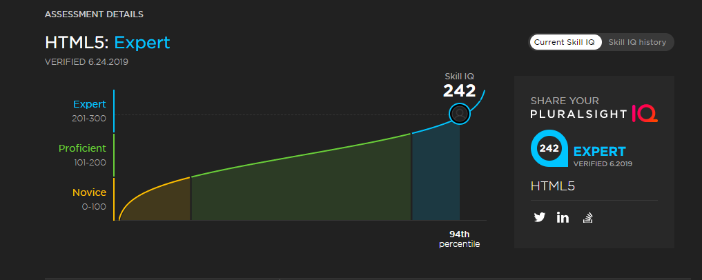

# 150DaysOfALC4

## DAY 1
I've always wanted to learn more about __Progressive Web Apps__ so after setting up my pc and installing all installables, I jumped right into Progressive Web Apps Fundamentals and learning!

### Lessons
PWAs should be: 
* _Responsive_
* _Work offline_
* _App-like Interaction_
* _Fresh_
* _safe_
* _Discoverable_
* _Re-engageable_
* _Installable_
* _Linkable_

I also started learning about the *web manifest* working towards making **Bookey** installable! :)

#### RESOURCES/ FUN FACTS:
[FaviconGenerator](https://realfavicongenerator.net/) is used to generate favicons and _manifest.json_ files for making a web app installable!

I spent over 2 hours trying to figure out the error while to testing my BOOKEY for installablity without knowing the I provided the wrong path as the _src_ of _icons_ for andriod display :)

## DAY 2

Finished the Semantic HTML course and started Meeting Web #a11y Guidelines! 
Did you know we have caption tag for the title of a table?
With role="img" and title we can also make #svg accessible?
Updates PWA with BooKey: I encountered a blocker

### NOTE

I need to study more on manifest events
I just installed it on my phone using "add to home screen" ft, but I got an error from GitHub when trying to access the page. What'd be the cause? 

## Day 3&4
Started the Practical #html5 course, coding along with instructor to build an online store!
I just learned that header can l be used more than once! Float and Clear became more clearer and I'm not even done with module 3!

## Day 5&6
Continued with the practical #html5 course, taking my time to fully understand #APIs like local storage and GeoLocation. HTML5 is way more than what I thought it was! 🥰😍

## Day 7
Just completed the Practical #HTML5 course! Thanks @gillcleeren for such great content! From semantics, styling, drag&drop, GeoLocation, canvas, #svg! 👌🔥
I also learned and built a Twitter Bot 😍. Waiting for access to the API

### NOTE: 
Towards the end of today, my Twitter account was restricted for some reasons I don't know of. So updates on my process will be documented here. To be shared later when I regain access to my account. *Learing Continues!*

## Day 8
Today, I decided to take a break and retake my HTML5 Skill IQ test, and guess what? I am now a verified **HTML5 Expert** *by Pluralsight!* Moving from a proficient score *(167)* to an expert score *(242)* in just 8 days is pure prove that with **commiment, determination and Grace, nothing is impossible!**

Thank you so much *Google Africa*, *Andela* and *Pluralsight* for this wonderful opportunity to level up my web development skills towards becoming world class! I can't wait for what the future holds! #LearningContinues...!!

## DAY 9 && 10
These two days were more of practical days for me. I started off building an [Issue Tracker](https://github.com/UcheSylvester/Issue-Tracker) to help track my issues with code (pun intended 😸) and also completed my [Task Manager](https://github.com/UcheSylvester/Task-Manager) APP (I still need to be able to delete task and mark task as completed). I also initialized an empty repo for yet another project [GITHUB_USERS](https://github.com/UcheSylvester/GITHUB_USERS) for viewing github users profiles (still planning out the projects for it's contents)

Also, in my bid to understand more about audio and video on the web, I started the *HTML5 Audio, Video, and WebRTC course by Mark Boas* and it's been interesting so far. I hope to learn as much as possible, build some mini projects, complete the *HTML5 Path* courses before DAY 14. 
I believe I can do that 💪💪

#### NOTE:
I'm also committing to finally completing 2 of my *udemy courses*
* *Build a Quiz App with HTML, CSS and JavaScript* 
* *Complete Web Developer in 2019: Zero To Mastery*
within this period of #150DaysOfALC4 challenge. It's gonna be one hell of a ride for me but I'll scarce through, God willing... 💪💪

## DAY 11 

Still on my *HTML5 Audio, Video, and WebRTC course by Mark Boas*, learning so basic things and how to properly integrate video and audio to web apps. I also learned of various formats of media and dynamically adding media via javascript. I also created a helper function to help add multiple attributes at once

// for setting multiple attributes
function setAttributes(element, attributes) {
    for(let key in attributes) {
        element.setAttribute(key, attributes[key])  //calling the setAttribute passing in key(attribute to set) and values
    }
}

I also started the *Build A Quiz app* course on Udemy and it's been funny really. Just some basic stuff and project set up 😄

## DAY 12 && 13

Network around here has been messy lately, even with etisalat (which is expensive btw) and I haven't been able to get much done seriously, still learning HTML5 Media. 

On the brighter side, I created a repo for another project (God save me the way I'm creating repos for everything these days :sweat_smile:), it's gonna be a **browser based media player** that allows you to drag musics and video to the browser and watch it play! Tho I haven't started it yet, I really excited about it

I look forward to the meetup today so I can meet with other amazing learner, see what they are all working and learning them as well. I will also be having my first facilitating session today, I am a bit nervous seriously, but I believe I will pull through. Expect updates later 😄

## DAY 13

Today I had my very first code facilitation session/experience at the #ALC4 meetup 1.0 held at the Rad5Tech Hub, Aba, and it was better than I thought.
Introduced learners to learning with pluralsight and web development fundamentals, and it felt wonderful! :heart_eyes::fire:

This reminds me so much of when I started about a year ago as an absolute beginner with ALC 3.0! It's really amazing how much one can grow in such a short period of time and we've not even started!
The dedication I saw in learners today was golden:heart_eyes:
Thank you so much Google, Andela and Pluralsight for this amazing opportunity! :pray::pray:

## DAY 14

I just finished the *Building on HTML5: Optimizing for Data, Communication and Offline Apps* by *Craig Shoemaker* a lot of content and lessons learned. I'm more interested in the GeoLocation API and I hope to use it in build apps with amazing features!

I also learned about the *Web Socket* and how it makes loading pages much more faster, *Service Workers* for offline apps (I need to study more on this)

At these stage I feel a lot more comfortable with *HTML5* than when I started this program and I think I can now move forward to learning *CSS* 💪 💪

