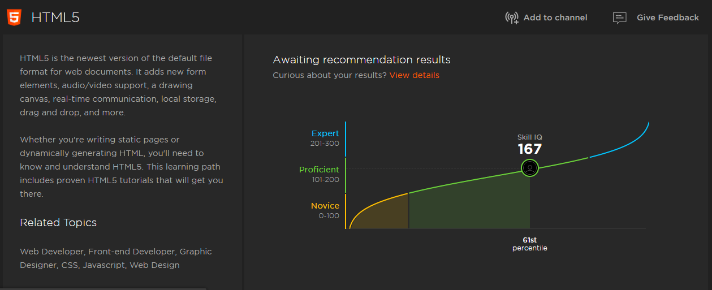

# 150DaysOfALC4

## DAY 1
I've always wanted to learn more about __Progressive Web Apps__ so after setting up my pc and installing all installables, I jumped right into Progressive Web Apps Fundamentals and learning!

### Lessons
PWAs should be: 
* _Responsive_
* _Work offline_
* _App-like Interaction_
* _Fresh_
* _safe_
* _Discoverable_
* _Re-engageable_
* _Installable_
* _Linkable_

I also started learning about the *web manifest* working towards making **Bookey** installable! :)

### RESOURCES/ FUN FACTS:
[FaviconGenerator](https://realfavicongenerator.net/) is used to generate favicons and _manifest.json_ files for making a web app installable!

I spent over 2 hours trying to figure out the error while to testing my BOOKEY for installablity without knowing the I provided the wrong path as the _src_ of _icons_ for andriod display :)

## DAY 2

Finished the Semantic HTML course and started Meeting Web #a11y Guidelines! 
Did you know we have caption tag for the title of a table?
With role="img" and title we can also make #svg accessible?
Updates PWA with BooKey: I encountered a blocker

### NOTE

I need to study more on manifest events
I just installed it on my phone using "add to home screen" ft, but I got an error from GitHub when trying to access the page. What'd be the cause? 

## Day 3&4
Started the Practical #html5 course, coding along with instructor to build an online store!
I just learned that header can l be used more than once! Float and Clear became more clearer and I'm not even done with module 3!

## Day 5&6
Continued with the practical #html5 course, taking my time to fully understand #APIs like local storage and GeoLocation. HTML5 is way more than what I thought it was! 🥰😍

## Day 7
Just completed the Practical #HTML5 course! Thanks @gillcleeren for such great content! From semantics, styling, drag&drop, GeoLocation, canvas, #svg! 👌🔥
I also learned and built a Twitter Bot 😍. Waiting for access to the API

### NOTE: 
Towards the end of today, my Twitter account was restricted for some reasons I don't know of. So updates on my process will be documented here. To be shared later when I regain access to my account. *Learing Continues!*

## Day 8
Today, I decided to take a break and retake my HTML5 Skill IQ test, and guess what? I am now a verified **HTML5 Expert** *by Pluralsight!* Moving from a proficient score *(167)* to an expert score *(242)* in just 8 days is pure prove that with **commiment, determination and Grace, nothing is impossible!**

Thank you so much *Google Africa*, *Andela* and *Pluralsight* for this wonderful opportunity to level up my web development skills towards becoming world class! I can't wait for what the future holds! #LearningContinues...!!

